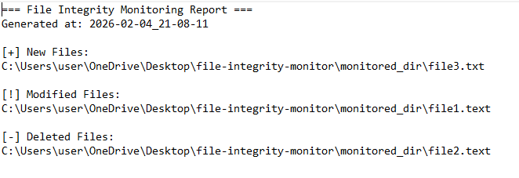

# File Integrity Monitor  
Change Detection & System Tampering Simulation (DFIR Project)

## 📌 Overview

This project monitors file integrity using hashing techniques to detect unauthorized modifications.

Simulates how SOC and DFIR teams identify persistence mechanisms and system tampering.

---

## 🧪 Simulated Incident

Critical system files are modified unexpectedly, potentially indicating unauthorized access or persistence activity.

The tool tracks baseline hashes and detects any file changes.

---

## 🔎 Investigation Workflow

1. Baseline hash generation  
2. File monitoring initiated  
3. Hash comparison performed  
4. Modified files identified  
5. Alert generated  
6. Evidence exported  
7. Investigation summary created  

---

## 📊 Extracted Evidence

### File Modification Detection


---

## 🧠 Detection Logic

- SHA256 baseline hashing  
- Continuous integrity checks  
- Change detection triggers alerts  
- Evidence preserved for investigation  

---

## 🗂️ MITRE ATT&CK Mapping

- Persistence via File Modification → T1547  
- Defense Evasion (File Changes) → T1565  

---

## 🔎 Analyst Notes

- Unauthorized file modification indicates possible persistence attempt  
- Integrity violations align with post-compromise activity patterns  

---

## ▶️ How to Run

```bash
python -m core.main
```

---

## 📁 Output

- modified file logs  
- alert outputs  
- integrity reports  

Stored in:
- `reports/`

---

## 🎯 Objective

Demonstrate file integrity monitoring, tampering detection, and DFIR-style investigation workflow.